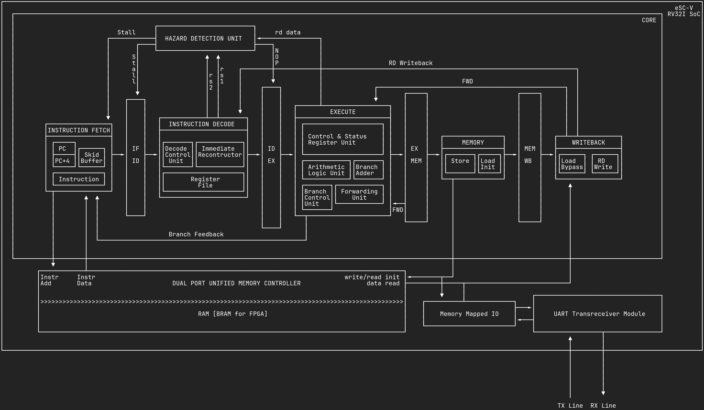

# eSC-V: RV32I SoC in VHDL

## Introduction

eSC-V is a 5-stage pipelined RV32I Zicsr RISC-V SoC implemented entirely in VHDL. The SoC has a dual-port unified memory controller that synthesizes to BRAM, a UART for communication, and has been verified using the RISC-V Compatibility Framework (RISCOF).

The complete tooling is open source, and the FPGA used is the Tang Primer 20K, which has an open source (reverse engineered) bitstream. Nix is used to keep the development environment and toolchain consistent.

## Architecture

<p align="center">
  
</p>

## Usage

From the project root, enter the Nix development shell. The Makefile handles building software, simulation, and synthesis directly without needing to change directories.

```bash
nix develop

```

### Simulation

Run the SoC simulation. The build system will automatically compile the selected software variant before running the simulation.

```bash
# Run with ASCII Tetris (default)
make run

# Run with specific software
make run pong-c
make run libc

# View waveforms
make view

```

### FPGA Synthesis & Programming

Synthesize the SoC with the selected software initialized in BRAM and program the FPGA (SRAM).

```bash
# Program with Tetris (default)
make program

# Program with specific software
make program pong-c

```

**Available Variants:** `ascii-tetris`, `pong-c`, `libc`

> **Note:** For custom hardware constraints, modify `constraints/fpga.cst`.

## Project Structure

```text
eSC-V/
├── constraints/           # FPGA constraint files
│   └── fpga.cst
├── docs/                  # Documentation and diagrams
│   ├── dev_docs/
│   ├── micro-architecture.png
│   └── riscv_docs/
├── software/              # Software and firmware
│   ├── apps
│   ├── common
│   ├── drivers
│   ├── Makefile
│   └── tests
├── src/                   # VHDL module implementations
│   ├── core.vhd
│   ├── soc.vhd
│   ├── IF_stage/
│   ├── ID_stage/
│   ├── EX_stage/
│   ├── MEM_stage/
│   ├── WB_stage/
│   ├── UART/
│   └── unified_memory_unit.vhd
├── tb/                    # Testbench files
│   ├── tb_soc.vhd
│   └── tb_soc_riscof.vhd
├── verification/          # Verification frameworks
│   └── riscof/
├── Makefile               # Build and simulation commands
├── flake.nix              # Nix development environment
└── README.md              # Project documentation
```

## Todo

- [x] 5 Stage Pipeline
- [x] Core
- [x] Memory Controller
- [x] UART
- [x] SoC
- [x] Architectural Verification with RISCOF
- [x] Bootstrap C
- [x] Bootstrap libC
- [x] Tetris
- [x] Pong
- [ ] Wishbone Interconnect
- [ ] DDR3 controller
- [ ] Cache
- [ ] ASCII Doom
- [ ] Branch Prediction Unit
- [ ] C Extension
- [ ] M Extension
- [ ] A Extension

## Contributing

### Setup

Install Nix using the Determinate Systems installer:

```bash
curl -fsSL https://install.determinate.systems/nix | sh -s -- install --determinate
```

Fork the repository at [github.com/ethycS0/eSC-V](https://github.com/ethycS0/eSC-V), then clone your fork:

```bash
git clone git@github.com:your_github_username/eSC-V.git
cd eSC-V
```

### Development

Enter the development environment (required for each terminal session):

```bash
nix develop
```

Place implementations in `src/` and testbenches in `tb/` . Use the Makefile to build and test:

```bash
make run TB=tb_module    # Run simulation
make view                # View waveforms
```

### Submitting Changes

Clean generated files before committing. I personally use this awesome [formatter](https://g2384.github.io/VHDLFormatter/) to format code and comments before committing.

```bash
make clean
git add .
git commit -m "feat: implement module"
git push origin main
```

Open a pull request from your fork on GitHub with a clear description of your changes.

## Resources

- [RISC-V Specification](https://riscv.org/technical/specifications/)
- [GHDL Documentation](https://ghdl.github.io/ghdl/)
- [GTKWave Documentation](http://gtkwave.sourceforge.net/)
- [Nix Manual](https://nixos.org/manual/nix/stable/)
