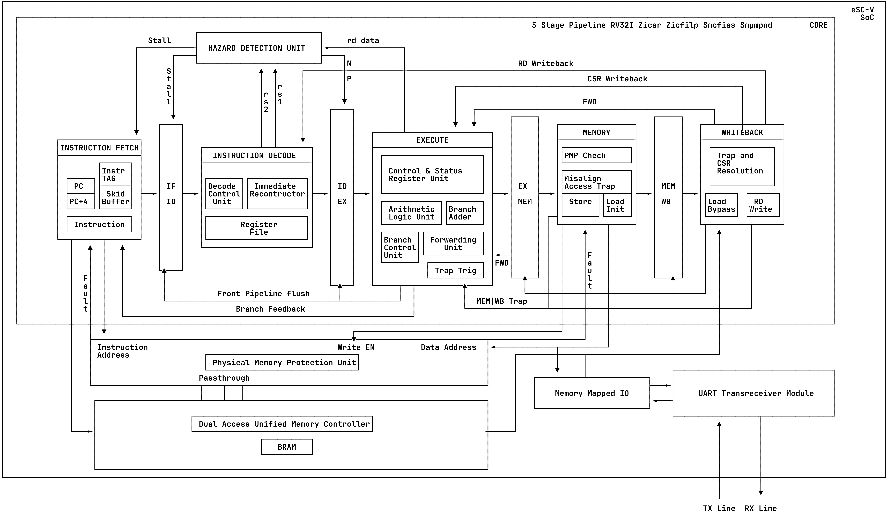

# eSC-V: M mode CFI-Hardened RV32I SoC in VHDL

## Introduction

eSC-V is a 5-stage pipelined RV32I Zicsr Zicfilp Smcfiss Smpmpind RISC-V SoC implemented entirely in VHDL. It is designed to provide hardware-enforced Control-Flow Integrity (CFI) for bare-metal, M-mode microcontrollers. To protect against Return-Oriented Programming (ROP) and Jump-Oriented Programming (JOP) , the core integrates the Zicfilp extension for forward-edge protection and the draft Smcfiss and Smpmpind extensions to enforce a hardware shadow stack.

The SoC has a dual-port unified memory controller that synthesizes to BRAM, a UART for communication, and has been verified against Sail and Spike formal models using the RISC-V Compatibility Framework (RISCOF).

The complete tooling is open source, and the FPGA used is the Tang Primer 20K, running at 60 MHz with an open-source (reverse-engineered) bitstream. Nix is used to keep the development environment consistent and to manage the custom GCC toolchain required for compiling the CFI extensions.

## Architecture

<p align="center">
  
</p>

## Project Structure

```text
eSC-V/
├── constraints/           # FPGA constraint files
│   └── fpga.cst
├── docs/                  # Documentation and diagrams
│   ├── dev_docs/
│   ├── pipeline.png
│   └── specifications/
├── software/              # Software and firmware
│   ├── apps
│   ├── common
│   ├── drivers
│   ├── Makefile
│   └── tests
├── src/                   # VHDL module implementations
│   ├── core.vhd
│   ├── soc.vhd
│   ├── IF_stage/
│   ├── ID_stage/
│   ├── EX_stage/
│   └── ...
├── tb/                    # Testbench files
│   ├── tb_soc.vhd
│   └── tb_soc_riscof.vhd
├── verification/          # Verification frameworks
│   └── riscof/
├── Makefile               # Build and simulation commands
├── flake.nix              # Nix development environment
└── README.md              # Project documentation
```

## Usage

### Starting the Environment

From the project root, enter the Nix development shell. The Makefile handles building software, simulation, and synthesis directly without needing to change directories.

```bash
nix develop
```

### Software Variants

The build system will automatically compile the selected software variant before running simulation or synthesis.

**Standard Applications:**

- `ascii-tetris` (Default): A Tetris game playable over UART.
- `pong-c`: A Pong game playable over UART.
- `libc`: Functional tests for newlib functions like `printf`.

**Security Validation:**

- `smcfiss`: A vulnerable C program designed to test backward-edge protection (shadow stack).
- `zicfilp`: A vulnerable C program designed to test forward-edge protection (landing pads).

### Simulation

```bash
# Run with ASCII Tetris (default)
make run
# Run with specific software
make run pong-c
make run libc
# View waveforms
make view
```

### FPGA Synthesis & Programming

> **Note:** For custom hardware constraints, modify `constraints/fpga.cst`.

```bash
# Program with Tetris (default)
make program
# Program with a specific application
make program pong-c
# Program with a vulnerable CFI test program
make program smcfiss
```

### Security Testing

To validate hardware-enforced CFI, a proof-of-concept exploit environment is provided. The `smcfiss` and `zicfilp` variants contain a `vulnerable_function()` that accepts UART input without bounds checking and print the address of an unreachable `win_function()`.

**Steps:**

> CFI protections can be disabled individually by commenting out `-D__ENABLE_ZICFILP__` or `-D__ENABLE_SMCFISS__` in the respective Makefile under `software/tests/`.

1. Build and program the FPGA with a vulnerable target:

```bash
make program smcfiss
# OR
make program zicfilp
```

2. Run the corresponding exploit script:

```bash
python3 scripts/smcfiss_exploit.py
# OR
python3 scripts/zicfilp_exploit.py
```

3. **Observe the Results:**
   - **Without CFI:** The exploit succeeds, redirecting control flow to `win_function()`.
   - **With CFI Enabled:** The hardware traps the violation and outputs a fatal crash report over UART.

## Todo

- [x] 5 Stage Pipeline
- [x] Core
- [x] Memory Controller
- [x] UART
- [x] SoC
- [x] Architectural Verification with RISCOF
- [x] Bootstrap C
- [x] Bootstrap libC
- [x] Tetris
- [x] Pong
- [x] Zicfilp
- [x] Smpmpind
- [x] Smcfiss
- [ ] Bootloader
- [ ] Wishbone Interconnect
- [ ] DDR3 controller
- [ ] Cache
- [ ] ASCII Doom
- [ ] Branch Prediction Unit

## Contributing

### Setup

Install Nix using the Determinate Systems installer:

```bash
curl -fsSL https://install.determinate.systems/nix | sh -s -- install --determinate
```

Fork the repository at [github.com/ethycS0/eSC-V](https://github.com/ethycS0/eSC-V), then clone your fork:

```bash
git clone git@github.com:your_github_username/eSC-V.git
cd eSC-V
```

### Development

Enter the development environment (required for each terminal session):

```bash
nix develop
```

Place implementations in `src/` and testbenches in `tb/` . Use the Makefile to build and test:

```bash
make run TB=tb_module    # Run simulation
make view                # View waveforms
```

### Submitting Changes

Clean generated files before committing. I personally use this awesome [formatter](https://g2384.github.io/VHDLFormatter/) to format code and comments before committing.

```bash
make clean
git add .
git commit -m "feat: implement module"
git push origin main
```

Open a pull request from your fork on GitHub with a clear description of your changes.

## Resources

- [RISC-V Specification](https://riscv.org/technical/specifications/)
- [GHDL Documentation](https://ghdl.github.io/ghdl/)
- [GTKWave Documentation](http://gtkwave.sourceforge.net/)
- [Nix Manual](https://nixos.org/manual/nix/stable/)
